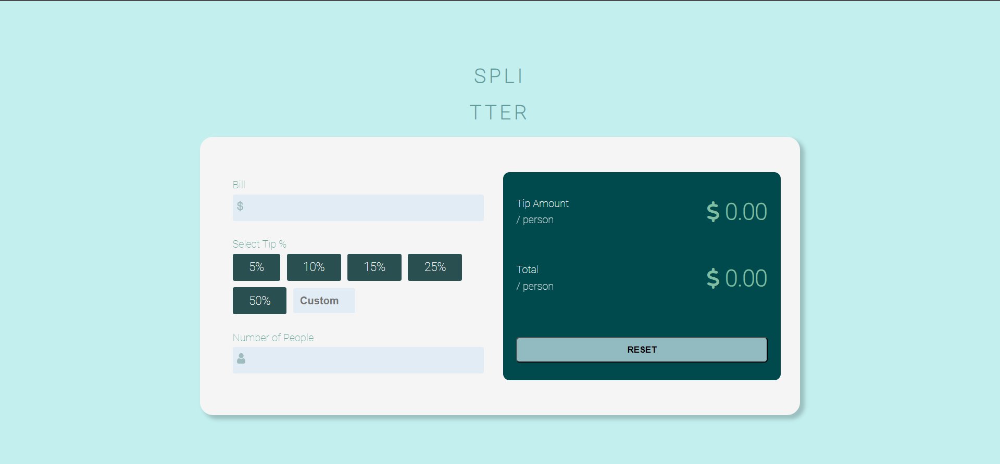

# Tip Calculator

The Tip Calculator is a simple web application that helps you calculate the tip amount and split the bill among multiple people. It allows you to quickly and accurately determine how much each person should contribute, making it easy to split bills in restaurants, cafes, or any other shared expenses.

## [Live Preview](https://tapan31.github.io/tip-calculator-app/)

## Features

- Calculate tip amount based on bill total and selected tip percentage
- Support for custom tip percentage input
- Split the bill among multiple people
- Responsive design for seamless usage on different devices

## Technologies Used

- HTML
- CSS
- JavaScript

## Getting Started

To use the Tip Calculator app locally, follow these steps:

1. Clone the repository: git clone https://github.com/tapan31/tip-calculator-app.git
 
2. Open the `index.html` file in your web browser.

3. Enter the bill amount, select a tip percentage, and specify the number of people.

4. The tip amount per person and total amount per person will be displayed automatically.

## Contributing

Contributions are welcome! If you have any suggestions, bug fixes, or feature requests, please open an issue or submit a pull request. Make sure to follow the existing code style and guidelines.

## Acknowledgements

- [Font Awesome](https://fontawesome.com/) for the icons used in the app.
- [Frontend Mentor](https://www.frontendmentor.io) for the design inspiration.

